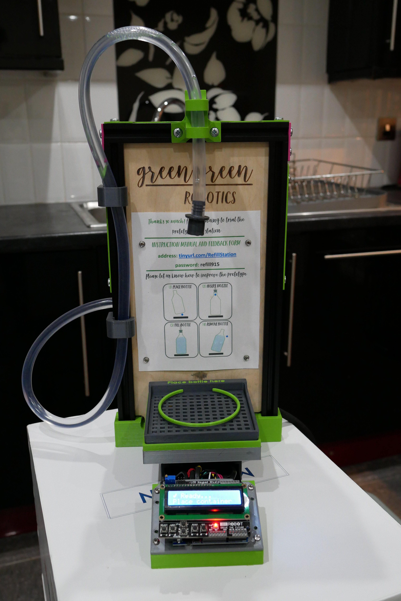
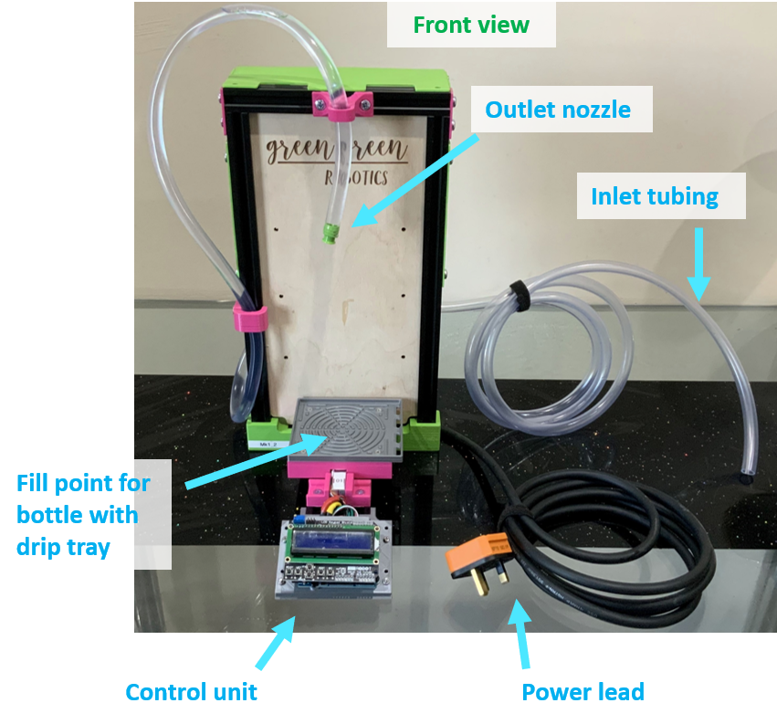
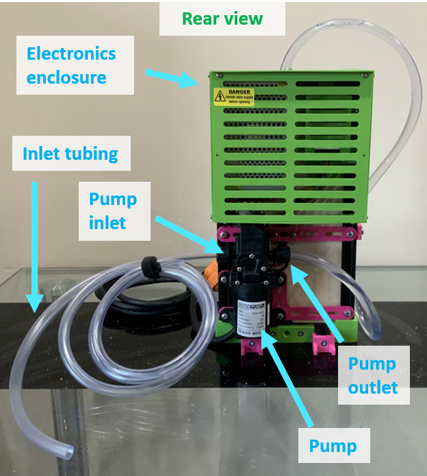
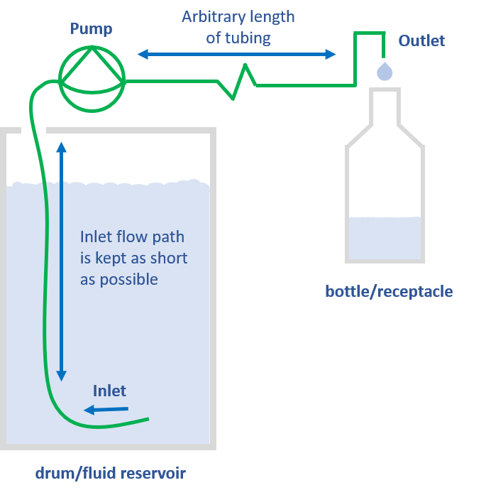

#  Refill station repository 

This is a repository which contains information for assembly and testing of a refill station prototype

## Contents

* Overview of the refill station
* Repository structure
* Prerequisties

## Overview of the refill station

The refill station is a low cost machine which is used to fill containers with fluid. It is inteded for use in a zero waste store or distributor. In these type of stores fluids are often slow and messy to refill because of their viscocity. The refill station solves this problem.

The operating principle of the refill station is simple, it uses a diaphragm pump controlled by the user to move fluid from a bulk container into a smaller refill container (as shown in the images below).

| Prototype Front                     | Prototype Back                     | Working Principle                      |
| ----------------------------------- | ---------------------------------- | -------------------------------------- |
|  |  |  |

### More information

General information on the refill station prototypes can be found on Green Green Robotics [main website](www.greengreenrobotics.com)

More information on how the refil station is operated can be found at this [weblink](https://meisben.github.io/refill_station_multimedia_supplement/) using the password: refill915

### Variants of the refill station prototoypes

Here high level details are listed on the prototypes which have created and tested / or are under development.

| Unique name |                               Purpose                               | Microcontroller type |
| :---------: | :-----------------------------------------------------------------: | :------------------: |
|     MK0     |    Proof of concept of pump, and load cell (pump and load cell)     |       Arduino        |
|     MK1     | First prototype to be tested with FILL refill (pump and load cell)  |       Arduino        |
|     MK2     | Second prototype to be tested with FILL refill (pump and load cell) |       Arduino        |
|  MK3_basic  |      First prototype for testing in refill stores  (pump only)      |  Raspberry Pi Pico   |

## Repository structure
The repository has the following structure

|   Folder name   |                            Contents                             |           Comment            |
| :-------------: | :-------------------------------------------------------------: | :--------------------------: |
|    assembly     |                      Assembly instructions                      | Note: Not yet fully complete |
|      debug      |                    Used to store debug logs                     |             N/A              |
|     images      |                        Images for Readme                        |             N/A              |
| production_code | Code used for the refill stations in a 'production' environment |             N/A              |
|     record      |     Record of attributes for each completed refill station      |             N/A              |
|      tests      |                      Testing instructions                       |             N/A              |

